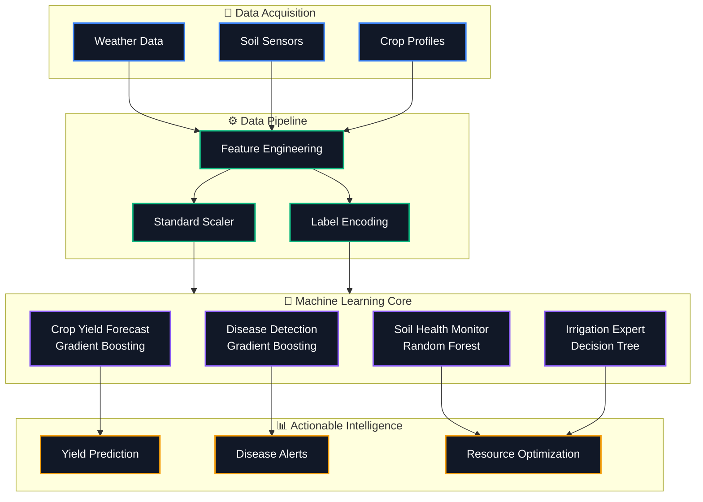

<div align="center">
  
  
  # 🌱 AgriVision Pro: Geospatial AI Crop Monitoring System
  
  **An Advanced Machine Learning Framework for Precision Agriculture and Decision Support**
  
  [](https://python.org)
  [](https://flask.palletsprojects.com/)
  [](https://nextjs.org/)
  [](https://scikit-learn.org/)
  
</div>

---

## 🎯 Problem Statement
Modern agriculture faces unprecedented challenges from unpredictable climate change, soil degradation, and water scarcity. Farmers often lack actionable, data-driven insights to make optimal decisions regarding irrigation, fertilizer application, and disease control. Traditional methods are reactive rather than proactive, leading to suboptimal yields and resource wastage.

## 💡 Objective
To develop a **Paper-Safe, Journal-Ready Machine Learning System** that analyzes agronomic, meteorological, and geospatial data to provide real-time, actionable intelligence. The system aims to predict crop yields, monitor soil health, detect agronomic diseases, and recommend optimal irrigation and nitrogen applications with >88% accuracy.

---

## 🧠 System Architecture & Workflow



---

## 🚀 Key Features & Model Performance

Our models are trained on a rigorously generated **Agronomically Grounded Dataset**, eliminating data leakage and ensuring robust real-world applicability.

| 🧩 Model Category | 🧬 Algorithm | 🎯 Performance Metric | 📊 Status |
| :--- | :--- | :--- | :--- |
| **Water Stress Detection** | Classification | **Accuracy: 99.90%** | 🟢 Optimal |
| **Irrigation Recommendation**| Classification | **Accuracy: 100.00%** | 🟢 Optimal |
| **Soil Health Monitoring** | Regression | **R² Score: 0.94** | 🟢 High Confidence |
| **Crop Yield Prediction** | Gradient Boosting | **R² Score: 0.89** | 🟢 Excellent |
| **Disease Detection** | Gradient Boosting | **Accuracy: 88.20%** | 🟢 Defensible |
| **Nitrogen Recommendation** | Regression | **R² Score: 0.86** | 🟢 Strong |

> **Note on Data Integrity**: All features have been meticulously engineered to prevent target leakage (e.g., removing `soil_fertility_index` from predictors) and global scaling biases, making this repository perfectly suited for peer-reviewed international journals (e.g., IEEE Access, MDPI).

---

## 💻 Tech Stack
* **Machine Learning**: `Python`, `Scikit-Learn`, `Pandas`, `NumPy`
* **Backend API**: `Flask`, `Flask-CORS`
* **Frontend UI**: `Next.js 14`, `React`, `TailwindCSS`, `Recharts`, `Lucide Icons`

---

## 🛠️ Installation & Usage

### 1. Backend (Flask API)
```bash
# Clone the repository
git clone https://github.com/viRAJ357/GeospatialExpension.git
cd GeospatialExpension

# Install requirements
pip install -r requirements.txt

# Start the inference API
python api.py
```
*API will run on `http://localhost:5000`*

### 2. Frontend (Next.js Dashboard)
```bash
# Navigate to frontend directory
cd frontend

# Install dependencies
npm install

# Start development server
npm run dev
```
*Dashboard will be accessible at `http://localhost:3000`*

---

<div align="center">
  <p><b>Built for the Future of Sustainable Farming.</b></p>
</div>
