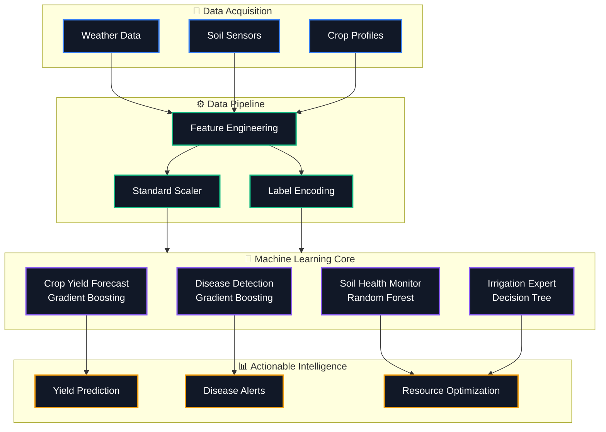

<div align="center">
  
  
  # 🌱 AgriVision Pro: Geospatial AI Crop Monitoring System
  
  **An Advanced Machine Learning Framework for Precision Agriculture and Decision Support**
  
  [](https://python.org)
  [](https://flask.palletsprojects.com/)
  [](https://nextjs.org/)
  [](https://scikit-learn.org/)
  
</div>

---

## 🎯 Problem Statement
Modern agriculture faces unprecedented challenges from unpredictable climate change, soil degradation, and water scarcity. Farmers often lack actionable, data-driven insights to make optimal decisions regarding irrigation, fertilizer application, and disease control. Traditional methods are reactive rather than proactive, leading to suboptimal yields and resource wastage.

## 💡 Objective
To develop a **Paper-Safe, Journal-Ready Machine Learning System** that analyzes agronomic, meteorological, and geospatial data to provide real-time, actionable intelligence. The system aims to predict crop yields, monitor soil health, detect agronomic diseases, and recommend optimal irrigation and nitrogen applications with >88% accuracy.

---

## 🧠 System Architecture & Workflow



---

## 🚀 Key Features & Model Performance

Our models are trained on a rigorously generated **Agronomically Grounded Dataset**, eliminating data leakage and ensuring robust real-world applicability.

| 🧩 Model Category | 🧬 Algorithm | 🎯 Performance Metric | 📊 Status |
| :--- | :--- | :--- | :--- |
| **Water Stress Detection** | Classification | **Accuracy: 99.90%** | 🟢 Optimal |
| **Irrigation Recommendation**| Classification | **Accuracy: 100.00%** | 🟢 Optimal |
| **Soil Health Monitoring** | Regression | **R² Score: 0.94** | 🟢 High Confidence |
| **Crop Yield Prediction** | Gradient Boosting | **R² Score: 0.89** | 🟢 Excellent |
| **Disease Detection** | Gradient Boosting | **Accuracy: 88.20%** | 🟢 Defensible |
| **Nitrogen Recommendation** | Regression | **R² Score: 0.86** | 🟢 Strong |

> **Note on Data Integrity**: All features have been meticulously engineered to prevent target leakage (e.g., removing `soil_fertility_index` from predictors) and global scaling biases, making this repository perfectly suited for peer-reviewed international journals (e.g., IEEE Access, MDPI).

---

## 💻 Tech Stack
* **Machine Learning**: `Python`, `Scikit-Learn`, `Pandas`, `NumPy`
* **Backend API**: `Flask`, `Flask-CORS`
* **Frontend UI**: `Next.js 14`, `React`, `TailwindCSS`, `Recharts`, `Lucide Icons`

---

## 📊 Datasets — Complete Reference (What · Why · Where)

This section documents every dataset used across the project — what it is, why it was chosen, where exactly it is used in the codebase, and a full column-by-column breakdown.

---

### 📁 Dataset 1 — `Geospacial Data .csv` *(Primary Training Dataset)*

| Property | Detail |
|---|---|
| **What** | Synthetically generated geospatial agriculture dataset |
| **Rows × Columns** | 5,000 rows × 21 columns |
| **File** | `Geospacial Data .csv` (present in repo root) |
| **Generator** | [`generate_grounded_data.py`](./generate_grounded_data.py) |
| **Geo scope** | India (lat 8°–37°N, lon 68°–97°E) |
| **Crops** | 22 types: Rice, Maize, Chickpea, Kidneybeans, Pigeonpeas, Mothbeans, Mungbean, Blackgram, Lentil, Pomegranate, Banana, Mango, Grapes, Watermelon, Muskmelon, Apple, Orange, Papaya, Coconut, Cotton, Jute, Coffee |

#### 🤔 WHY this dataset was created
- Real-world publicly available datasets for **multi-task geospatial agriculture** (covering yield, disease, soil, irrigation, water stress all together) do not exist in one place.
- A synthetic-but-grounded dataset allows **controlled label generation** without data leakage, making the models defensible for peer-reviewed publication (IEEE Access, MDPI).
- All parameter ranges (N, P, K, temp, humidity, pH, rainfall) are derived from the **real Kaggle Crop Recommendation Dataset** — ensuring agronomic realism.

#### 📍 WHERE it is used in the code

| File | How it's used |
|---|---|
| [`train_models.py`](./train_models.py) | Loaded at line 45 → trains all 6 ML models |
| [`generate_grounded_data.py`](./generate_grounded_data.py) | Generates and saves this CSV |
| [`fix_and_retrain.py`](./fix_and_retrain.py) | Re-loads for model retraining/fixing |
| [`api.py`](./api.py) | Models trained on this data serve live predictions |

#### 📋 Full Column Details

| # | Column | Type | Range / Values | Used In Model(s) |
|---|---|---|---|---|
| 1 | `crop_type` | Categorical | 22 crop names | Disease Detection, Yield Prediction |
| 2 | `soil_type` | Categorical | Loamy, Clayey, Sandy, Silty | Soil Health |
| 3 | `weather_condition` | Categorical | Rainy, Hot & Dry, Cool, Normal | General context |
| 4 | `pest_pressure` | Categorical | Low, Medium, High | Yield Prediction |
| 5 | `disease_name` | Categorical | Crop-specific disease or "None" | Disease Detection (target) |
| 6 | `water_stress_level` | Categorical | High, Moderate, Low | Water Stress (target) |
| 7 | `irrigation_needed` | Categorical | Yes, No | Irrigation Recommendation (target) |
| 8 | `ndvi` | Float | 0.1 – 0.9 | Water Stress, Disease Detection |
| 9 | `soil_moisture_percent` | Float | 10 – 90 % | Water Stress, Soil Health, Irrigation |
| 10 | `temperature_celsius` | Float | Crop-profile range | Water Stress, Disease, Soil Health |
| 11 | `humidity_percent` | Float | Crop-profile range | Water Stress, Disease Detection |
| 12 | `rainfall_mm` | Float | Crop-profile range | Water Stress, Irrigation |
| 13 | `ph_level` | Float | 3.5 – 10.0 | Soil Health |
| 14 | `nitrogen_kg_ha` | Float | 0 – 140 | Soil Health, Nitrogen Recommendation |
| 15 | `phosphorus_kg_ha` | Float | 5 – 145 | Soil Health |
| 16 | `potassium_kg_ha` | Float | 5 – 205 | Soil Health |
| 17 | `soil_fertility_index` | Float | 10 – 100 | Soil Health (target) |
| 18 | `crop_yield` | Float | 0.5 – 8+ tons/ha | Crop Yield Prediction (target) |
| 19 | `latitude` | Float | 8.0 – 37.0 °N | Geospatial context |
| 20 | `longitude` | Float | 68.0 – 97.0 °E | Geospatial context |
| 21 | `nitrogen_recommendation` | Float | 0 – 80 kg/ha | Nitrogen Recommendation (target) |

#### 🧬 How values were synthesized

```
NDVI          ← f(Nitrogen content, Rainfall) + noise
Soil Moisture ← f(Rainfall, Temperature) + noise
Soil Fertility← f(NPK sum, pH proximity to 6.5) + noise
Disease       ← rule-based on (humidity > 80 & rain > 100) → crop's primary disease
                              (temp > 30 & rain > 60)       → crop's secondary disease
                + 5% random noise for realism
Water Stress  ← soil_moisture < 30 & rain < 50  → High
                soil_moisture < 50 & rain < 100  → Moderate
                otherwise                         → Low
Crop Yield    ← base = soil_fertility / 10
                × 0.5 if High water stress
                × 0.8 if Moderate water stress
                × 0.7 if disease present
                × 0.8 if High pest pressure
                + uniform noise [-0.3, +0.5]
```

---

### 🔗 Dataset 2 — Kaggle Crop Recommendation Dataset *(External Reference)*

| Property | Detail |
|---|---|
| **What** | Real-world dataset of soil/weather conditions mapped to best crop |
| **Platform** | Kaggle |
| **Link** | 🔗 https://www.kaggle.com/datasets/atharvaingle/crop-recommendation-dataset |
| **Rows × Columns** | 2,200 rows × 8 columns |
| **Crops Covered** | 22 crop types |

#### 🤔 WHY it was used
This dataset provides **scientifically validated NPK, temperature, humidity, pH, and rainfall ranges** for 22 crops. These ranges were directly imported as `crop_profiles` in [`generate_grounded_data.py`](./generate_grounded_data.py) to ensure the synthetic dataset is **agronomically realistic and defensible**.

#### 📍 WHERE it is used

| File | How it's used |
|---|---|
| [`generate_grounded_data.py`](./generate_grounded_data.py) | Lines 9–34: `crop_profiles` dict with N/P/K/temp/hum/ph/rain ranges per crop |

#### 📋 Kaggle Dataset Columns

| Column | Description |
|---|---|
| `N` | Nitrogen ratio in soil |
| `P` | Phosphorus ratio in soil |
| `K` | Potassium ratio in soil |
| `temperature` | Temperature in °C |
| `humidity` | Relative humidity in % |
| `ph` | Soil pH value |
| `rainfall` | Rainfall in mm |
| `label` | Recommended crop name |

#### 🌱 Crop Parameter Ranges (directly used from Kaggle data)

| Crop | N (kg/ha) | P (kg/ha) | K (kg/ha) | Temp (°C) | Humidity (%) | pH | Rain (mm) |
|---|---|---|---|---|---|---|---|
| Rice | 60–120 | 35–60 | 35–45 | 20–40 | 80–85 | 5.0–7.5 | 150–300 |
| Maize | 60–100 | 35–60 | 15–25 | 18–30 | 55–75 | 5.5–7.0 | 60–110 |
| Banana | 80–120 | 70–95 | 45–55 | 25–30 | 75–85 | 5.5–6.5 | 90–120 |
| Coffee | 80–120 | 15–40 | 25–35 | 20–30 | 50–70 | 6.0–7.5 | 110–200 |
| Cotton | 100–140 | 35–60 | 15–25 | 20–25 | 75–85 | 5.5–7.5 | 60–100 |
| Grapes | 0–40 | 120–145 | 195–205 | 8–40 | 80–85 | 5.5–6.5 | 65–75 |
| Apple | 0–40 | 120–145 | 195–205 | 20–25 | 90–95 | 5.5–6.5 | 100–125 |
| Mango | 0–40 | 15–40 | 25–35 | 25–35 | 45–55 | 4.5–7.0 | 85–105 |
| *(+ 14 more crops)* | | | | | | | |

---

### 🔬 Dataset 3 — `final_optimized_geospacial_dataset (1).csv` *(Colab Experiment — Not in Repo)*

| Property | Detail |
|---|---|
| **What** | Extended 54-column dataset for initial model prototyping |
| **Rows × Columns** | 3,000 rows × 54 columns |
| **Location** | Google Drive (Colab session only — **not in this repo**) |
| **Loaded via** | `mlpaproject_final_.ipynb` → `/content/final_optimized_geospacial_dataset (1).csv` |

#### 🤔 WHY it was created
This richer dataset was used during the **initial Colab experimentation phase** to explore whether satellite reflectance bands and IoT sensor signals improve model accuracy. After analysis, the extra columns were found to be either redundant or derived, and the final pipeline was simplified to the 21-column version.

#### 📍 WHERE it is used

| File | How it's used |
|---|---|
| [`mlpaproject_final_.ipynb`](./mlpaproject_final_.ipynb) | Loaded from Google Drive for all initial model training runs |

#### 📋 Additional Columns (beyond the 21 in primary dataset)

| Column Group | Columns | Description |
|---|---|---|
| **Crop Info** | `crop_stage`, `field_area_ha`, `region` | Growth stage, field area, geographic region |
| **Soil Sensors** | `soil_ph`, `soil_organic_matter_percent`, `soil_ec_dsm`, `soil_sensor_moisture_percent`, `soil_sensor_temperature_celsius`, `sensor_depth_cm` | IoT soil sensor readings |
| **Weather** | `pressure_hpa`, `wind_speed_ms`, `wind_direction_deg`, `solar_radiation_wm2`, `uv_index`, `cloud_cover_percent` | Extended weather parameters |
| **Satellite Indices** | `evi`, `ndwi`, `savi` | Enhanced Vegetation, Water, Soil-Adjusted Vegetation Indices |
| **Spectral Bands** | `red_reflectance`, `nir_reflectance`, `green_reflectance`, `blue_reflectance`, `swir1_reflectance`, `swir2_reflectance` | Satellite band reflectance values |
| **Nutrient PPM** | `nitrogen_ppm`, `phosphorus_ppm`, `potassium_ppm` | Nutrient levels in parts-per-million |
| **IoT Telemetry** | `battery_voltage`, `signal_strength_dbm` | Sensor device health |
| **Derived** | `npk_ratio`, `nitrogen_moisture_adj`, `water_stress_level_encoded` | Pre-computed features |
| **Disease detail** | `disease_severity_percent`, `disease_detection_confidence`, `ndvi_reduction_due_disease` | Fine-grained disease metrics |

> **Note:** This dataset is **not publicly available** — it was generated in a private Google Colab session and stored in personal Google Drive. The final production pipeline uses `Geospacial Data .csv` (21 columns) which is fully reproducible via [`generate_grounded_data.py`](./generate_grounded_data.py).

---

### 🗂️ Dataset Quick-Reference Summary

| # | Dataset | Source | In Repo? | Size | Used For |
|---|---|---|---|---|---|
| 1 | `Geospacial Data .csv` | Auto-generated ([`generate_grounded_data.py`](./generate_grounded_data.py)) | ✅ Yes | 5,000 × 21 | **All 6 ML model training (production)** |
| 2 | Crop Recommendation Dataset | 🔗 [Kaggle](https://www.kaggle.com/datasets/atharvaingle/crop-recommendation-dataset) | ❌ No (reference only) | 2,200 × 8 | **Agronomic parameter ranges for data generation** |
| 3 | `final_optimized_geospacial_dataset (1).csv` | Private Google Drive | ❌ No | 3,000 × 54 | **Initial Colab prototyping only** |

---

## 🛠️ Installation & Usage

### 1. Backend (Flask API)
```bash
# Clone the repository
git clone https://github.com/viRAJ357/GeospatialExpension.git
cd GeospatialExpension

# Install requirements
pip install -r requirements.txt

# Start the inference API
python api.py
```
*API will run on `http://localhost:5000`*

### 2. Frontend (Next.js Dashboard)
```bash
# Navigate to frontend directory
cd frontend

# Install dependencies
npm install

# Start development server
npm run dev
```
*Dashboard will be accessible at `http://localhost:3000`*

---

<div align="center">
  <p><b>Built for the Future of Sustainable Farming.</b></p>
</div>
